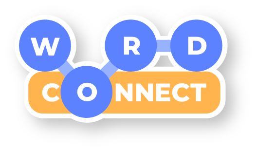
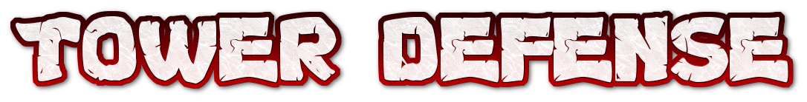
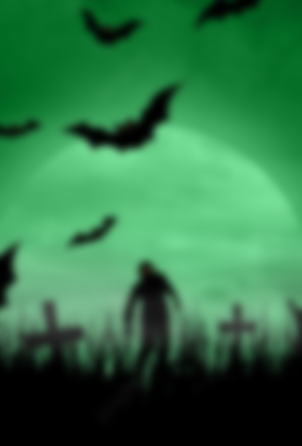

# Unity Mini-Game Collection

Repository containing two standalone Unity games: **Word Connect Puzzle** and **Tower Defense Zombie War**. Each game has its own Unity version, packages, scenes, and gameplay architecture.

<p align="center">
  
  &nbsp;&nbsp;&nbsp;
  
</p>

## Projects At A Glance

| Project | Genre | Unity Version | Entry Scene |
| --- | --- | --- | --- |
| [Word Connect Puzzle](#word-connect-puzzle) | Word / crossword puzzle | `6000.3.10f1` | `Demo - Portrait.unity` |
| [Tower Defense Zombie War](#tower-defense-zombie-war) | 2D zombie tower defense | `2022.3.62f2` | `Logo.unity` |

> Open each game as a separate Unity project. Do not open the repository root in Unity Hub.

## Repository Layout

```text
Share005_WordConnectPuzzle/
|-- README.md
|-- LICENSE
|-- docs/images/                  # README visuals copied from game assets
|-- WordConnectPuzzle/            # Unity 6000 Word Connect project
`-- TOWER DEFENSE ZOMBIE WAR/     # Unity 2022 Tower Defense project
```

---

# Word Connect Puzzle

<p align="center">
  
</p>

Word-connect puzzle built around the DTT Word Connect package. Players connect available letters to discover words arranged in a generated crossword-style grid.

## Word Connect Status

- Unity Editor: `6000.3.10f1`
- DTT Word Connect package: `1.0.2`
- Universal Render Pipeline: `17.3.0`
- Unity Input System: `1.18.0`
- Main build scene: `Assets/DTT/Word Connect/Demo/Scenes/Demo - Portrait.unity`
- Included sample content: 5 configured levels

## Word Connect Gameplay

- Connect letters to form and submit words
- Generate crossword-style layouts from word dictionaries
- Reward found words, correct-answer streaks, and fast completion
- Reveal letter, word, and descriptive hints
- Support pause, continue, restart, finish, and stop flows
- Handle desktop and mobile input
- Provide portrait and landscape demo scenes

## Open Word Connect

1. Open Unity Hub.
2. Select **Add project from disk**.
3. Choose `WordConnectPuzzle/`.
4. Open with Unity `6000.3.10f1`.
5. Open `Assets/DTT/Word Connect/Demo/Scenes/Demo - Portrait.unity`.
6. Enter Play Mode.

The portrait demo is already enabled in `ProjectSettings/EditorBuildSettings.asset`.

## Word Connect Architecture

Code preserves the DTT `Runtime / Editor / Demo` split:

- `DTT.WordConnect.Runtime` — game state, puzzle data, crossword generation, hints, scoring, and lifecycle
- `DTT.WordConnect.Editor` — editor-only tools and inspectors
- `DTT.WordConnect.Demo` — sample UI, input handlers, level selection, and scene integration

Runtime code uses the `DTT.WordConnect` namespace and implements `IMinigame<WordConnectConfigurationData, WordConnectResult>` from `DTT.MinigameBase`.

### Main Components

| Component | Responsibility |
| --- | --- |
| `WordConnectManager` | Controls lifecycle, input, hints, timing, scoring, and events |
| `WordConnectConfigurationData` | Stores level rules, dictionary, colors, hints, and scoring values |
| `WordConnectState` | Tracks input, found words, hint balances, streaks, and score |
| `WordHintDictionary` | Holds words available to a puzzle |
| `WordHintPair` | Pairs a word with an optional descriptive hint |
| `WordConnectLayout` | Stores generated grid tiles, letters, and word vectors |
| `AbstractedCrosswordAlgorithm` | Builds the crossword-style layout |
| `WordConnectResult` | Returns completion time and normalized/display scores |

## Word Connect Level Data

Sample levels live in:

```text
WordConnectPuzzle/Assets/DTT/Word Connect/Demo/Prefabs/Game Data/
```

The demo includes `Level 1` through `Level 5`. Create data through **Assets > Create > DTT > Word Connect**:

- **Config** — `WordConnectConfigurationData`
- **Word Hint Dictionary** — `WordHintDictionary`
- **Word Hint Pair** — `WordHintPair`

A configuration can define game name, color theme, dictionary, hint balances, expected completion time, scoring, completion curve, and longest-word hint priority.

## Word Connect Runtime API

```csharp
using DTT.WordConnect;
using UnityEngine;

public class WordConnectLauncher : MonoBehaviour
{
    [SerializeField] private WordConnectManager manager;
    [SerializeField] private WordConnectConfigurationData configuration;

    private void Start()
    {
        manager.StartGame(configuration);
    }
}
```

Lifecycle methods include `StartGame`, `Pause`, `Continue`, `ForceRestart`, `ForceFinish`, and `ForceStop`.

Gameplay methods include `HandleLetterInput`, `SubmitWord`, `RevealLetterHint`, `RevealWordHint`, and `RevealDescriptiveHint`.

Events include `Initialized`, `BuildGame`, `Started`, `StateUpdated`, `Paused`, `Continued`, `Finish`, and `Cleanup`.

## Word Connect Important Paths

- Portrait scene: `WordConnectPuzzle/Assets/DTT/Word Connect/Demo/Scenes/Demo - Portrait.unity`
- Landscape scene: `WordConnectPuzzle/Assets/DTT/Word Connect/Demo/Scenes/Demo - Landscape.unity`
- Input actions: `WordConnectPuzzle/Assets/DTT/Word Connect/Demo/WordConnectInputControls.inputactions`
- Demo scripts: `WordConnectPuzzle/Assets/DTT/Word Connect/Demo/Scripts/`
- Package documentation: `WordConnectPuzzle/Assets/DTT/Word Connect/Documentation.pdf`

---
# Tower Defense Zombie War

<p align="center">
  
</p>

<p align="center">
  
  &nbsp;&nbsp;&nbsp;
  
</p>

2D defense game where soldiers and fortress systems resist waves of zombies. The project includes enemy variants, weapons, status effects, upgrades, progression, shops, rewarded ads, and in-app purchasing hooks.

## Tower Defense Status

- Unity Editor: `2022.3.62f2`
- Rendering: Built-in 2D renderer
- Build scenes: `Logo.unity`, `Menu.unity`, and `Playing.unity`
- Unity UI: `1.0.0`
- TextMeshPro: `3.0.7`
- Unity Ads: `4.4.2`
- Unity Purchasing: `4.11.0`
- Input: legacy Unity input and touch/swipe handlers

## Tower Defense Gameplay

- Defend a fortress from configured zombie waves
- Spawn multiple enemy types from level-defined positions
- Use soldiers, crossbows, grenades, flame bottles, and projectiles
- Apply normal, poison, freeze, and lightning weapon effects
- Fight melee, ranged, throwing, and minion-summoning enemies
- Earn coins and level stars
- Unlock levels and retain progress with `PlayerPrefs`
- Add and upgrade defenders
- Purchase character and shop upgrades
- Support victory, game-over, pause, and resume states
- Integrate normal and rewarded ad flows
- Provide optional in-app purchase and remove-ads flows

## Open Tower Defense

1. Open Unity Hub.
2. Select **Add project from disk**.
3. Choose `TOWER DEFENSE ZOMBIE WAR/`.
4. Open with Unity `2022.3.62f2`.
5. Open `Assets/_DTZ_/Scene/Logo.unity`.
6. Enter Play Mode.

Configured build order:

1. `Assets/_DTZ_/Scene/Logo.unity`
2. `Assets/_DTZ_/Scene/Menu.unity`
3. `Assets/_DTZ_/Scene/Playing.unity`

## Tower Defense Architecture

Tower Defense uses the default `Assembly-CSharp` runtime assembly and organizes custom content under `Assets/_DTZ_/`.

| Area | Responsibility |
| --- | --- |
| `Script/GameManager.cs` | Owns game state, listeners, victory, game over, pause, and completion |
| `Script/GlobalValue.cs` | Stores coins, unlocked levels, stars, sound, music, and remove-ads state |
| `Script/SpawnEnemyManager/` | Defines waves and spawns enemy groups |
| `Script/SmartEnemy/` | Implements enemy movement, attacks, effects, and specialized behavior |
| `Script/SoldierController.cs` | Controls defender behavior and upgraded parameters |
| `Script/TheFortrest.cs` | Tracks fortress damage and triggers game over |
| `Script/GUI/` | Handles menus, map, tutorial, HUD, results, and level setup |
| `Script/Shop*.cs` | Handles coin rewards, purchases, upgrades, and shop UI |
| `AdController/` | Routes Unity Ads or AdMob normal/rewarded ad flows |
| `Editor/` | Contains custom inspectors and editor helpers |

Game lifecycle notifications use `IListener`. Systems react through `IPlay`, `IPause`, `IUnPause`, `ISuccess`, and `IGameOver` callbacks.

## Tower Defense Content Layout

```text
TOWER DEFENSE ZOMBIE WAR/Assets/_DTZ_/
|-- AdController/     # Ad network routing and rewarded ads
|-- Animation/        # Soldier, enemy, UI, and effect animation
|-- Audio/            # Music and sound effects
|-- Editor/           # Custom editor tooling
|-- Material/         # Runtime materials
|-- Prefab/
|   |-- Character/    # Soldiers and zombie prefabs
|   |-- FX/           # Weapon and status effects
|   |-- System/       # Managers, waves, maps, and helpers
|   `-- UI/           # Menus, shop, HUD, and results
|-- Resources/        # Runtime-loaded shared prefabs
|-- Scene/            # Logo, menu, and gameplay scenes
|-- Script/           # Gameplay and UI code
|-- Sprite/           # Characters, backgrounds, and interface art
`-- Texture/          # Additional textures and effects
```

## Tower Defense Important Paths

- Logo scene: `TOWER DEFENSE ZOMBIE WAR/Assets/_DTZ_/Scene/Logo.unity`
- Menu scene: `TOWER DEFENSE ZOMBIE WAR/Assets/_DTZ_/Scene/Menu.unity`
- Gameplay scene: `TOWER DEFENSE ZOMBIE WAR/Assets/_DTZ_/Scene/Playing.unity`
- Core scripts: `TOWER DEFENSE ZOMBIE WAR/Assets/_DTZ_/Script/`
- Enemy logic: `TOWER DEFENSE ZOMBIE WAR/Assets/_DTZ_/Script/SmartEnemy/`
- Enemy waves: `TOWER DEFENSE ZOMBIE WAR/Assets/_DTZ_/Script/SpawnEnemyManager/`
- Prefabs: `TOWER DEFENSE ZOMBIE WAR/Assets/_DTZ_/Prefab/`
- Packages: `TOWER DEFENSE ZOMBIE WAR/Packages/manifest.json`

## Monetization Notes

Tower Defense contains code and packages for Unity Ads, AdMob, rewarded ads, Unity IAP, coin purchases, and remove-ads behavior. Before shipping:

- Replace test or placeholder ad identifiers with production values.
- Confirm the selected ad network in `AdsManager`.
- Validate Android/iOS SDK dependencies and privacy requirements.
- Configure store products and purchasing callbacks.
- Test purchase restoration and failed transactions.
- Never commit private store credentials or production secrets.

---

# Development Rules

- Open each game with its matching Unity version.
- Do not edit `Library/`, `Temp/`, `Logs/`, `obj/`, `.vs/`, or `UserSettings/`.
- Preserve Unity `.meta` files when moving or renaming assets.
- Keep Word Connect runtime/editor/demo code inside matching DTT folders and assembly definitions.
- Keep Tower Defense runtime code under `Assets/_DTZ_/Script` and editor-only code under `Assets/_DTZ_/Editor`.
- Check Unity Console import and compile feedback after script or asset changes.

# Validation

## Word Connect Checklist

1. Open `Demo - Portrait.unity` with Unity `6000.3.10f1`.
2. Verify input, submission, hints, score, pause, restart, and completion.
3. Test `Demo - Landscape.unity` after responsive UI changes.

## Tower Defense Checklist

1. Open `Logo.unity` with Unity `2022.3.62f2`.
2. Verify scene flow from logo to menu to gameplay.
3. Start a level and confirm wave spawning, attacks, fortress damage, victory, and game over.
4. Verify coin rewards, upgrades, saved progress, sound, and music.
5. Test ads and purchases only with configured test environments.

This repository does not contain first-party automated project tests. Prefer Unity Editor compile feedback and Play Mode smoke testing.

# License

See [LICENSE](LICENSE).